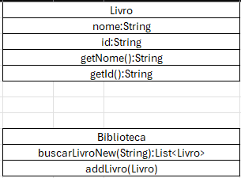
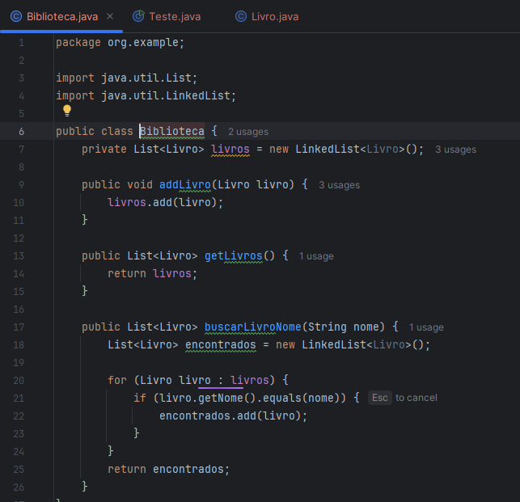
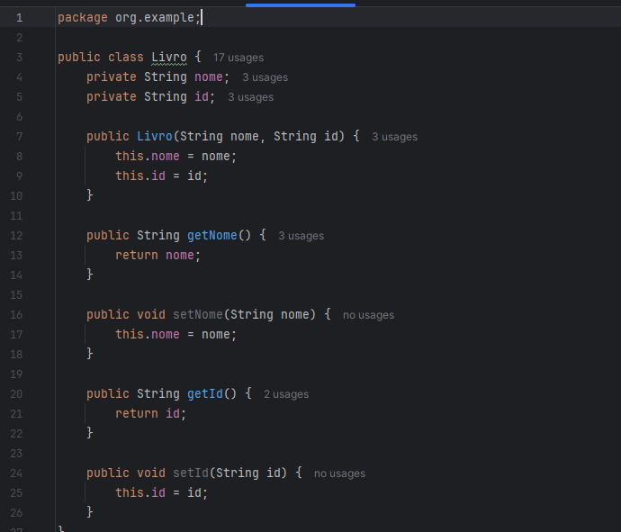
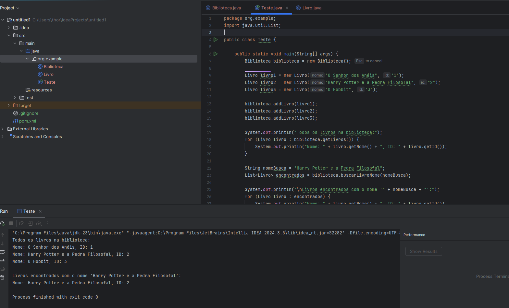

Comentar com suas palavras o primeiro trecho do livro Software Engineering at Google, Oreilly.

1 -  O trecho questiona o que é engenharia de software e nos coloca a dúvida do que a diferencia de Programação e ciência da computação.  É falado que os termos tem sido utilizados por muito tempo em nosso mercado porém os termos tem diferentes aplicações. Engenharia de software aplica o conhecimento teórico para desenvolver algo(software), induzindo que o conhecimento para desenvolver um software não remete apenas a programação, e sim o necessário para você desenvolver um programa, a parte da organização e seus processos.

Comentar com suas palavras o segundo trecho do livro Software Engineering at Google, Oreilly

2 - É falado que a engenharia de software inclui não só o código em si mas sim todos métodos de organiza-lo e faze-lo "durável" Por exemplo, caso seja necessário alterar algo no programa ou acrescentar algo, ele necessitará de padrões, ou uma organização boa para você conseguir mexer nele de uma forma que não prejudique outra parte do código. é falado três princípios que se deve ter para manter a organização do software, como que ele terá que mudar durante o tempo que ele estiver sendo utilizado, como ele poderá ser alterado caso necessário e seus tradeoffs(basicamente, pros e contras que o seu programa terá, considerando os dois primeiros princípios) 
Organização é a chave.

Listar e explicar 3 exemplos de tradeoffs
3 - 

- C++ e Python:
O C++ nos proporciona muito desempenho(velocidade), muito utilizado em aplicações embarcadas, enquanto Python, por ser mais distante do Hardware não tem tanto desempenho comparado a C++, porém é uma linguagem muito flexivel e de pouca complexidade, tornando o entendimento e o desenvolvimento do software no geral muito mais fácil.

- Java e Javascript
Java é robusto, seguro e estruturado, ótimo para grandes sistemas onde manter código legível e seguro a longo prazo é prioridade(como por exemplo, bancos.) O Javascript é uma linguagem com uma tipagem bem dinâmica com seu código sendo curto e rápido para escrever(Java é mais verboso.)

- Java e C

Java roda na JVM, o que facilita portabilidade entre sistemas operacionais, mas pode não ser tão otimizado quanto linguagens que compilam para código nativo, enquanto C pode ser altamente otimizado para uma plataforma específica, mas exige trabalho extra para ser portátil.

CLASSE UML
4 - 

CLASSES

5 - 

TESTE

6 -

